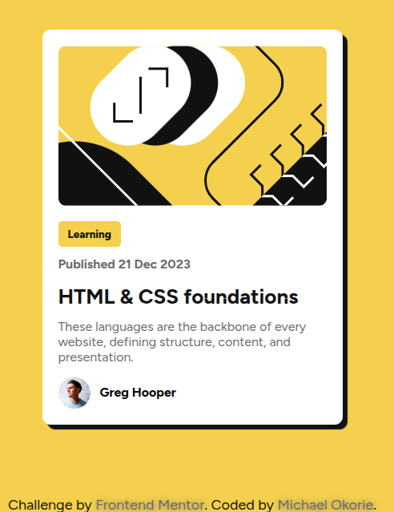

# blog-preview-card

This is a solution to the [Blog preview card challenge on Frontend Mentor](https://www.frontendmentor.io/challenges/blog-preview-card-ckPaj01IcS). Frontend Mentor challenges help you improve your coding skills by building realistic projects. 

## Table of contents

- [Overview](#overview)
  - [The challenge](#the-challenge)
  - [Screenshot](#screenshot)
  - [Links](#links)
  - [Built with](#built-with)
  - [What I learned](#what-i-learned)
  - [Continued development](#continued-development)
  - [Useful resources](#useful-resources)
- [Author](#author)
- [Acknowledgments](#acknowledgments)

### The challenge

Users should be able to:

- View the blog preview card with text and images presented clearly
- See well-structured, accessible content with simple, clean design

### Screenshot



### Links

- Solution URL: [https://github.com/Michael-Okorie/blog-preview-card.git]
- Live Site URL: [https://michael-okorie.github.io/blog-preview-card/]

### Built with

- Semantic HTML5 markup
- CSS custom properties
- Flexbox
- Mobile-first workflow
- [Vanilla CSS](https://www.w3.org/Style/CSS/) - For styling

### What I learned

- Using **Flexbox** made aligning elements inside the card easy.
- I learned the importance of **semantic HTML** and how it can enhance accessibility.

```html
    <div class="card">
      
      <button class="btn">Learning</button>
      <p class="pub">Published 21 Dec 2023</p>


```css
.avatar{
    float: left;
    width: 40px;
    height: 40px;
    margin-right: 12px;
    margin-top: -10px;
}

```

### Continued development

In future projects, I want to:

- Deepen my knowledge of CSS Grid for more complex layouts.
- Implement animations for smoother transitions, especially on hover and focus states.
- Continue improving accessibility practices by incorporating ARIA roles.

### Useful resources

- [CSS Tricks - Flexbox Guide](https://css-tricks.com/snippets/css/a-guide-to-flexbox/) – A must-read for mastering Flexbox layouts.
- [Frontend Mentor Discord](https://www.frontendmentor.io/discord) – Amazing community where you can get help and share ideas.
- [MDN Web Docs](https://developer.mozilla.org/en-US/) – The go-to resource for all web development concepts and documentation.

### Author

- Website – [Michael Okorie](https://github.com/Michael-Okorie)
- Frontend Mentor – [@Michael-Okorie](https://www.frontendmentor.io/profile/Michael-Okorie
- Twitter – [@Dev_Michael_](https://www.twitter.com/Dev_Michael_)

### Acknowledgments

A huge thank you to the Frontend Mentor community! Your feedback and solutions were incredibly inspiring. Special thanks to everyone who gave me tips on improving the responsiveness of the design. It was a fantastic learning experience!

